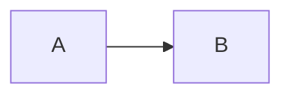

<!--
---
title: override title
emoji: 💥
---
-->
# Test-Markdown
Testing markdown fences




```js
const exampleNumber = 12;
console.log(exampleNumber);
```


<details>
  <summary>Testing supported HTML</summary>
  I think details are supported in gfm
</details>


```objectives
- [ ] Write a fenced block
- [ ] Parse it through the base64 blob
```

<!--
```objectives
- [ ] Write a fenced block
- [ ] Hide this one in comments
```
-->
